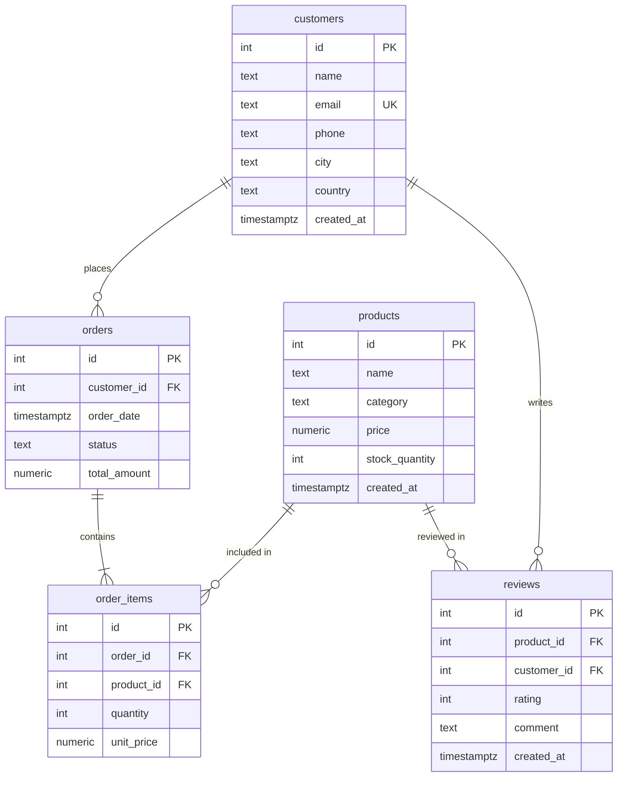

<div align="center">


<br/>

# 🧠 AI SQL — Natural Language to SQL Engine

### _Talk to your database like you talk to a human._

[](https://python.org)
[](https://openai.com)
[](https://supabase.com)
[](https://jupyter.org)
[](LICENSE)

<br/>

**AI SQL** is an intelligent, interactive SQL query engine that converts plain English questions into optimized PostgreSQL queries, executes them against a live Supabase database, and displays beautifully formatted results — all inside a Jupyter Notebook.

<br/>

[🚀 Quick Start](#-quick-start) •
[✨ Features](#-features) •
[🏗️ Architecture](#️-architecture) •
[📸 Screenshots](#-screenshots) •
[🧪 Try It Out](#-example-queries)

</div>

---

## ✨ Features

<table>
<tr>
<td width="50%">

### 🗣️ Natural Language Queries
Ask questions in plain English — no SQL knowledge required. The AI understands context, relationships, and business logic.

### 🤖 GPT-5.4-Mini Powered
Leverages OpenAI's latest model for accurate, optimized SQL generation with minimal hallucination.

### 🎨 Rich Terminal Output
Beautiful formatted tables, syntax-highlighted SQL, and colorful panels using the Rich library.

</td>
<td width="50%">

### ⚡ Live Database Execution
Queries run against a real Supabase PostgreSQL database in real-time via secure RPC calls.

### 🏭 Synthetic Data Generator
Built-in Faker-powered data generator creates realistic e-commerce data (customers, products, orders, reviews).

### 🔄 Interactive REPL Mode
Continuous query loop — ask as many questions as you want without re-running cells.

</td>
</tr>
</table>

---

## 🏗️ Architecture


---

## 📊 Database Schema

The project uses a fully relational e-commerce database with 5 interconnected tables:



<details>
<summary><b>📋 Table Details (click to expand)</b></summary>

<br/>

| Table | Columns | Description |
|:------|:--------|:------------|
| **customers** | `id`, `name`, `email`, `phone`, `city`, `country`, `created_at` | Store customer profiles with contact info and location |
| **products** | `id`, `name`, `category`, `price`, `stock_quantity`, `created_at` | Product catalog across 6 categories |
| **orders** | `id`, `customer_id`, `order_date`, `status`, `total_amount` | Customer orders with status tracking |
| **order_items** | `id`, `order_id`, `product_id`, `quantity`, `unit_price` | Line items linking orders to products |
| **reviews** | `id`, `product_id`, `customer_id`, `rating`, `comment`, `created_at` | Product reviews with 1-5 star ratings |

**Product Categories:** `Electronics` · `Clothing` · `Books` · `Home and Garden` · `Sports` · `Food and Beverages`

**Order Statuses:** `pending` · `processing` · `shipped` · `delivered` · `cancelled`

</details>

---

## 🚀 Quick Start

### Prerequisites

- Python 3.14+
- A [Supabase](https://supabase.com) account with a project
- An [OpenAI](https://openai.com) API key

### 1️⃣ Clone the Repository

```bash
git clone https://github.com/Avinash-Tewari/AI_Sql.git
cd AI_Sql
```

### 2️⃣ Create Virtual Environment

```bash
python -m venv venv

# Windows
venv\Scripts\activate

# macOS/Linux
source venv/bin/activate
```

### 3️⃣ Install Dependencies

```bash
pip install -r requirements.txt
```

<details>
<summary><b>📦 Full Dependency List</b></summary>

| Package | Purpose |
|:--------|:--------|
| `python-dotenv` | Load environment variables from `.env` |
| `faker` | Generate realistic synthetic data |
| `pandas` | Data manipulation and display |
| `rich` | Beautiful terminal formatting |
| `tabulate` | Table rendering support |
| `ipykernel` | Jupyter kernel support |
| `jupyter` | Notebook interface |
| `supabase` | Supabase Python client |
| `openai` | OpenAI API client |

</details>

### 4️⃣ Configure Environment

Create a `.env` file in the project root:

```env
SUPABASE_URL=https://your-project.supabase.co
SUPABASE_KEY=your-supabase-anon-key
OPENAI_API=your-openai-api-key
```

### 5️⃣ Set Up Supabase Database

Before running the notebook, create the required tables and the `execute_sql` RPC function in your Supabase SQL Editor:

<details>
<summary><b>📜 Database Setup SQL (click to expand)</b></summary>

```sql
-- Create tables
CREATE TABLE IF NOT EXISTS customers (
    id SERIAL PRIMARY KEY,
    name TEXT NOT NULL,
    email TEXT UNIQUE NOT NULL,
    phone TEXT,
    city TEXT,
    country TEXT,
    created_at TIMESTAMPTZ DEFAULT NOW()
);

CREATE TABLE IF NOT EXISTS products (
    id SERIAL PRIMARY KEY,
    name TEXT NOT NULL,
    category TEXT NOT NULL,
    price NUMERIC(10,2) NOT NULL,
    stock_quantity INTEGER DEFAULT 0,
    created_at TIMESTAMPTZ DEFAULT NOW()
);

CREATE TABLE IF NOT EXISTS orders (
    id SERIAL PRIMARY KEY,
    customer_id INTEGER REFERENCES customers(id),
    order_date TIMESTAMPTZ DEFAULT NOW(),
    status TEXT DEFAULT 'pending',
    total_amount NUMERIC(10,2) DEFAULT 0
);

CREATE TABLE IF NOT EXISTS order_items (
    id SERIAL PRIMARY KEY,
    order_id INTEGER REFERENCES orders(id),
    product_id INTEGER REFERENCES products(id),
    quantity INTEGER NOT NULL,
    unit_price NUMERIC(10,2) NOT NULL
);

CREATE TABLE IF NOT EXISTS reviews (
    id SERIAL PRIMARY KEY,
    product_id INTEGER REFERENCES products(id),
    customer_id INTEGER REFERENCES customers(id),
    rating INTEGER CHECK (rating >= 1 AND rating <= 5),
    comment TEXT,
    created_at TIMESTAMPTZ DEFAULT NOW()
);

-- RPC function for executing dynamic SQL
CREATE OR REPLACE FUNCTION execute_sql(query TEXT)
RETURNS JSONB
LANGUAGE plpgsql
SECURITY DEFINER
AS $$
DECLARE
    result JSONB;
BEGIN
    EXECUTE 'SELECT jsonb_agg(row_to_json(t)) FROM (' || query || ') t'
    INTO result;
    RETURN COALESCE(result, '[]'::JSONB);
END;
$$;
```

</details>

### 6️⃣ Launch the Notebook

```bash
jupyter notebook main.ipynb
```

---

## 🧪 Example Queries

Here are some questions you can ask the AI SQL engine. Just call `ask()` with any natural language question:

<table>
<tr>
<th>🏷️ Category</th>
<th>💬 Question</th>
<th>🔍 What It Does</th>
</tr>
<tr>
<td><b>🛒 Sales</b></td>
<td><code>ask("Show me the top 5 customers who spent the most money")</code></td>
<td>Aggregates order totals per customer, ranks by spend</td>
</tr>
<tr>
<td><b>⭐ Reviews</b></td>
<td><code>ask("What is the average rating for each product category?")</code></td>
<td>Joins products + reviews, groups by category</td>
</tr>
<tr>
<td><b>📦 Inventory</b></td>
<td><code>ask("List all products that have never been ordered")</code></td>
<td>LEFT JOIN with NULL check to find unordered products</td>
</tr>
<tr>
<td><b>📈 Trends</b></td>
<td><code>ask("Show monthly revenue for the last 3 months")</code></td>
<td>Date truncation + aggregation with interval filtering</td>
</tr>
<tr>
<td><b>👤 Customers</b></td>
<td><code>ask("Which customers have placed more than 5 orders?")</code></td>
<td>HAVING clause on COUNT aggregation</td>
</tr>
<tr>
<td><b>🏪 Products</b></td>
<td><code>ask("What are the most expensive products in each category?")</code></td>
<td>Window functions or subquery with MAX</td>
</tr>
<tr>
<td><b>📊 Analytics</b></td>
<td><code>ask("Show the order status distribution")</code></td>
<td>GROUP BY with COUNT and percentage calculation</td>
</tr>
<tr>
<td><b>🔗 Complex</b></td>
<td><code>ask("Find customers who bought products they also reviewed")</code></td>
<td>Multi-table JOIN across orders, items, and reviews</td>
</tr>
</table>

---

## 📸 Screenshots

<details>
<summary><b>🖥️ AI SQL Query in Action (click to expand)</b></summary>

<br/>

The notebook generates SQL from your question, executes it, and displays formatted results:

**Question:** _"Show me the top 5 customers who spent the most money"_

The AI generates a `SELECT` with `JOIN`, `GROUP BY`, `ORDER BY DESC`, and `LIMIT 5` — then displays results in a beautifully formatted Rich table with customer IDs, names, emails, and total spend amounts.

</details>

<details>
<summary><b>📊 Database Schema Visualization (click to expand)</b></summary>

<br/>

The project includes a fully relational schema with 5 tables: `customers`, `products`, `orders`, `order_items`, and `reviews` — connected via foreign keys for a realistic e-commerce data model.

</details>

---

## 🧩 How It Works

```
┌─────────────────────────────────────────────────────────────────┐
│                        NOTEBOOK CELLS                          │
├─────────────────────────────────────────────────────────────────┤
│                                                                 │
│  Cell 1  │ 🔧 Initialize clients (Supabase + OpenAI)          │
│  Cell 2  │ 📊 Define database schema context                  │
│  Cell 3  │ 🏭 Generate & insert fake data (Faker)             │
│  Cell 4  │ ✅ Verify data with summary table                  │
│  Cell 5  │ 🤖 Define AI SQL engine functions                  │
│  Cell 6+ │ 💬 Run queries with ask("your question")           │
│  Last    │ 🔄 Interactive REPL loop                            │
│                                                                 │
└─────────────────────────────────────────────────────────────────┘
```

### Core Functions

| Function | Description |
|:---------|:------------|
| `nl_to_sql(question)` | Sends the question + schema to GPT-5.4-Mini, returns raw SQL |
| `run_query(sql)` | Executes SQL via Supabase `execute_sql` RPC function |
| `display_results(data)` | Renders results as a Rich formatted table |
| `ask(question)` | **Main function** — combines all three above into one call |

### AI Prompt Engineering

The system prompt includes:
- ✅ Full database schema with column types and constraints
- ✅ Valid enum values for `category` and `status` fields
- ✅ Rules for proper JOINs, aliases, and result limits
- ✅ Instructions to return **only** raw SQL (no markdown, no explanations)

---

## 📁 Project Structure

```
AI_Sql/
├── 📓 main.ipynb          # Main Jupyter notebook (all logic lives here)
├── 🐍 main.py             # Entry point placeholder
├── 📋 requirements.txt    # Python dependencies
├── ⚙️ pyproject.toml       # Project metadata
├── 🔒 .env                # API keys (not committed)
├── 🚫 .gitignore          # Git ignore rules
├── 📖 README.md           # You are here!
└── 🎨 assets/             # Images and media
    └── banner.png         # Project banner
```

---

## 🔒 Security Notes

> [!WARNING]
> **Never commit your `.env` file!** It contains sensitive API keys. The `.gitignore` is already configured to exclude it.

> [!IMPORTANT]
> The `execute_sql` RPC function uses `SECURITY DEFINER` — ensure your Supabase RLS policies are properly configured for production use.

---

## 🛠️ Tech Stack

<div align="center">

| Layer | Technology | Role |
|:------|:-----------|:-----|
| 🧠 AI | OpenAI GPT-5.4-Mini | Natural language → SQL translation |
| 🗄️ Database | Supabase (PostgreSQL) | Data storage + query execution |
| 📓 Interface | Jupyter Notebook | Interactive development environment |
| 🎨 Display | Rich + Pandas | Beautiful terminal output |
| 🏭 Data Gen | Faker | Synthetic e-commerce data |
| 🐍 Language | Python 3.14+ | Core runtime |

</div>

---

## 🗺️ Roadmap

- [x] Natural language to SQL conversion
- [x] Live database execution via Supabase RPC
- [x] Rich formatted output with syntax highlighting
- [x] Synthetic data generation with Faker
- [x] Interactive REPL mode
- [ ] Query history and caching
- [ ] Multi-model support (Claude, Gemini, Llama)
- [ ] Web UI with Streamlit/Gradio
- [ ] Query explanation mode (show _why_ the SQL was generated)
- [ ] Export results to CSV/Excel
- [ ] Voice input support

---

## 🤝 Contributing

Contributions are welcome! Here's how to get started:

1. **Fork** the repository
2. **Create** a feature branch (`git checkout -b feature/amazing-feature`)
3. **Commit** your changes (`git commit -m 'Add amazing feature'`)
4. **Push** to the branch (`git push origin feature/amazing-feature`)
5. **Open** a Pull Request

---

## 📄 License

This project is open source and available under the [MIT License](LICENSE).

---

<div align="center">

**Built with ❤️ by [Avinash Tewari](https://github.com/Avinash-Tewari)**

<br/>

⭐ **Star this repo if you found it useful!** ⭐

<br/>

[](https://github.com/Avinash-Tewari)

</div>
